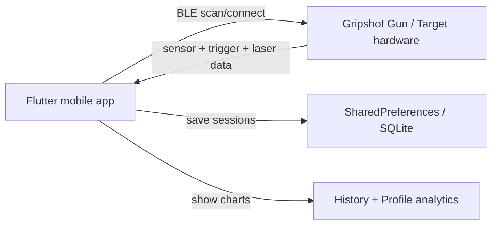

# Gripshot Dry-Fire Training Gun Documentation

## 1. Project overview

This repository is the software layer for a dry-fire training gun system named Gripshot. The app is built with Flutter and interacts over Bluetooth Low Energy (BLE) with a physical training gun and optional target hardware.

The project combines:
- a mobile app UI for training, history, and profile tracking
- BLE scanning and connection to the gun / target devices
- real-time sensor processing and target hit scoring
- local session storage for saved training results
- support for Arduino/ESP32-based hardware using serial BLE services

The intended use is a dry-fire practice setup where a user connects a Gripshot gun to a phone, fires simulated rounds, and tracks performance metrics such as grip, pitch, score, and accuracy.

---

## 2. High-level architecture

### Main data flow
1. The Flutter app requests Bluetooth and location permissions.
2. It scans for nearby devices named like “Gripshot Gun” or “Gripshot Target”.
3. It connects to the gun and target peripherals over BLE.
4. The gun sends sensor and trigger data as strings over BLE notifications.
5. The app parses the incoming data, records hits, updates score, and stores session metrics.
6. Training session data is saved locally and shown in the History/Profile screens.

---

## 3. Root project files

### [README.md](README.md)
Purpose:
- Default Flutter starter documentation.
- It is not yet customized to this project and still contains the standard template text.

What it tells you:
- This was originally generated as a Flutter app skeleton.
- It does not describe the actual Gripshot device workflow.

Suggested improvement:
- Replace it with the real project summary, install instructions, hardware notes, and troubleshooting steps.

### [pubspec.yaml](pubspec.yaml)
Purpose:
- Declares app dependencies and Flutter project settings.

Important dependencies:
- `flutter_blue_plus`: BLE connectivity to the training gun and target
- `permission_handler`: Bluetooth and storage permission management
- `location`: required on Android for BLE scanning
- `shared_preferences`: storing profiles and training history
- `sqflite`: local SQLite database support
- `fl_chart`: analytics chart rendering
- `image_picker`: profile photo upload
- `google_fonts`: app styling

Why this matters:
- The project is designed around BLE hardware communication and local analytic persistence.

### [hardware/gripshot_gun.ino](../hardware/gripshot_gun.ino)
Purpose:
- This is the Arduino firmware for the physical gun hardware.

What it does:
- Initializes pins for the button, solenoid, buzzer, and laser.
- Detects trigger press events.
- Activates hardware outputs when the button is pressed.
- Sends BLE notifications to the connected mobile device using the configured GATT service/characteristic.

This file is the hardware side of the application and must match the BLE UUID values expected by the Flutter app.

---

## 4. Flutter app entry points

### [lib/main.dart](lib/main.dart)
Purpose:
- App bootstrap and permission gate.

What it does:
- Calls `WidgetsFlutterBinding.ensureInitialized()`
- Requests Bluetooth and location permissions before startup
- Creates the main `MaterialApp`
- Loads the initial screen and registers app routes

Important behavior:
- The app sets `home` to `InitialPermissionHandler` and then `HomePage(initialTab: 2)`
- This means it starts on the Profile tab by default
- `navigatorKey` is created globally for use by code outside the widget tree

Why it matters:
- This is the first file run by the app and is responsible for all early setup.

### [lib/pages/home_page.dart](lib/pages/home_page.dart)
Purpose:
- Top-level navigation shell for the app.

What it does:
- Displays the app bar with the title “GRIPSHOT”
- Holds the tab-based navigation between Training, History, and Profile
- Uses a `NavigationBar` to switch views

Tabs:
- Training
- History
- Profile

This is the central hub of the app after permissions are granted.

---

## 5. Permission and security flow

### [lib/widgets/initial_permission_handler.dart](lib/widgets/initial_permission_handler.dart)
Purpose:
- Ensures all permissions are granted before the app continues.

What it does:
- Checks storage access
- Requests location permission for Android BLE scanning
- Requests Bluetooth, Bluetooth Scan, and Bluetooth Connect permissions
- Shows blocking dialogs if denied
- Displays a loader until permissions pass

Why this matters:
- BLE scanning on Android requires location permission.
- Without this step, the app cannot discover gun or target devices reliably.

### [lib/utils/permission_handler.dart](lib/utils/permission_handler.dart)
Purpose:
- Helper for storage/media permission handling.

What it does:
- Requests the correct permission based on Android version
- Shows explanatory dialogs if a setting is permanently denied
- Redirects the user to system settings when needed

This file supports the app’s permission gate for session persistence.

---

## 6. BLE training flow

### [lib/pages/training_page.dart](lib/pages/training_page.dart)
Purpose:
- Device discovery and connection flow for the training gun.

What it does:
- Subscribes to FlutterBluePlus scanning results
- Checks whether Bluetooth is enabled and available
- Requests location permission if necessary
- Searches for devices whose names match “Gripshot Gun”
- Displays scan results and allows the user to connect

Key constants:
- `GRIPSHOT_SERVICE_UUID = "6e400001-b5a3-f393-e0a9-e50e24dcca9e"`

This file is the entry point for connecting to the hardware gun itself.

How to use it:
- Launch the app
- Grant the required permissions
- Open the Training tab
- Start scanning
- Connect to the Gripshot gun device
- Move into the live training session screen

---

## 7. Live connection and data parsing

### [lib/pages/connected_page.dart](lib/pages/connected_page.dart)
Purpose:
- Handles an active BLE connection to a gun and shows live data history.

What it does:
- Detects when the device disconnects
- Discovers BLE services
- Enables notifications for characteristics that support them
- Interprets raw BLE data strings as they arrive
- Keeps a rolling list of the latest incoming values

This is a simpler BLE monitoring screen used while connected to a gun or target, before the more advanced training system is engaged.

Important concept:
- The app listens to `notify` characteristics and logs the values in `dataHistory`.

---

## 8. Core training logic

### [lib/pages/connected_device_page.dart](lib/pages/connected_device_page.dart)
Purpose:
- This is the most important file in the app.
- It contains the dry-fire weapon training logic, sensor processing, scoring, save flow, and training session analytics.

What it contains:
- BLE connection management for the gun and an optional target
- sensor parsing for grip, pitch, and touch values
- hit detection from trigger + laser events
- score tracking on a 4x4 target grid
- bullet count and training completion rules
- session data storage in SharedPreferences
- rendering of charts and metrics

Key concepts inside this file:

#### Target grid
- `gridRows = 4`
- `gridColumns = 4`
- `gridScores` defines a score per cell
- cells are mapped to photo/laser channels using `photoPins` and `channelGridMap`

#### Hardware event monitoring
- Trigger message examples include:
  - `button_pressed`
  - `BUTTON PRESSED`
- Laser detection examples include:
  - `LASER DETECTED at GPIO ...`
  - `LASER DETECTED MUX CH ... -> ...`
  - `LASER DETECTED ON MUX CH ...`

#### Scoring
- When a trigger press and a target laser hit occur in a valid timing window, the app records a hit.
- Hit cells contribute point values based on a 4x4 score matrix.
- The score resets for each new session, but is saved at the end.

#### Session persistence
- Session results are saved into SharedPreferences as JSON strings under `training_sessions`.
- This is how past sessions appear on the History screen.

#### Training flow
- It supports:
  - practice mode
  - regular training mode
  - forced start prompt states
  - completion dialogs and score summaries

This file is the main logic engine for the Gripshot dry-fire training system.

---

## 9. History and analytics

### [lib/pages/history_page.dart](lib/pages/history_page.dart)
Purpose:
- Displays saved sessions, loads session JSON, and provides detail drill-down screens.

What it does:
- Reads `training_sessions` from SharedPreferences
- Parses each session into a map format
- Sorts newest-first
- Shows a summary list of past training sessions
- Opens a session detail dialog with charts for grip, pitch, and touch over time
- Displays score, accuracy, duration, and average metrics

This is the analytics layer for measuring improvement over time.

---

## 10. User profile and personalization

### [lib/pages/profile_page.dart](lib/pages/profile_page.dart)
Purpose:
- User profile management and progress analysis.

What it does:
- Loads profile data from SharedPreferences
- Supports name, age, sex, and photo
- Keeps a welcome flow for first-time setup
- Shows personal training metrics over selected date ranges
- Uses charts to represent session averages and trends

Data keys used include:
- `profile_name`
- `profile_sex`
- `profile_age`
- `profile_image_path`
- `training_sessions`
- `has_shown_welcome`

This screen ties progress analytics to a user identity.

### [lib/models/user_profile.dart](lib/models/user_profile.dart)
Purpose:
- Simple immutable user model for profile state.

What it does:
- Holds the name, sex, age, and onboarding flag
- Provides `toMap()` and `fromMap()` conversion methods for storing data in app preferences or database layers

This is a lightweight model used to represent a user profile in code.

### [lib/models/user.dart](lib/models/user.dart)
Purpose:
- Model for a stored app user, including profile image path.

This is likely the app’s general user record model and is related to profile persistence.

---

## 11. Local database layer

### [lib/data/local/database/database_helper.dart](lib/data/local/database/database_helper.dart)
Purpose:
- Local SQLite helper, storing session summary rows in a `training_sessions` table.

What it does:
- Opens `gripshot.db`
- Creates the `training_sessions` table
- Inserts session rows
- Queries all sessions ordered by timestamp
- Deletes sessions by ID

This is a simpler local database path for saved training data.

### [lib/data/local/database/app_database.dart](lib/data/local/database/app_database.dart)
Purpose:
- More general SQLite database wrapper used for app data modeling.

What it does:
- Creates tables such as:
  - `users`
  - `shots`
  - `categories`
  - `likes`
  - `comments`

This file appears to be a broader app-data layer, but the actual product flow in this project is more clearly driven by SharedPreferences than by this database object.

---

## 12. Arduino / hardware integration guide

This is the most important part for connecting the hardware to the app.

### Hardware side
The Arduino code file is [gripshot_gun.ino](gripshot_gun.ino).

It should be loaded onto the microcontroller used in the Gripshot gun. It is designed to control the dry-fire system and send BLE notifications to the phone.

Typical hardware components likely used:
- trigger button
- solenoid
- buzzer
- laser output
- ESP32 / Arduino-compatible BLE board

### BLE pairing and UUID matching
The Flutter app expects BLE services that match the device’s transmitted UUIDs.

From [lib/pages/training_page.dart](lib/pages/training_page.dart):
- `GRIPSHOT_SERVICE_UUID = "6e400001-b5a3-f393-e0a9-e50e24dcca9e"`

From [lib/pages/connected_device_page.dart](lib/pages/connected_device_page.dart):
- `SENSOR_SERVICE_UUID = "6e400001-b5a3-f393-e0a9-e50e24dcca9e"`
- `SENSOR_CHARACTERISTIC_UUID = "6e400003-b5a3-f393-e0a9-e50e24dcca9e"`
- `TARGET_SERVICE_UUID = "12345678-1234-5678-1234-56789abcdef0"`
- `TARGET_CHARACTERISTIC_UUID = "12345678-1234-5678-1234-56789abcdef1"`

These are the critical integration points.

### What the hardware must send
The app parses strings like:
- `button_pressed`
- `BUTTON PRESSED`
- `LASER DETECTED at GPIO ...`
- `LASER DETECTED MUX CH ...`
- `LASER DETECTED ON MUX CH ...`
- sensor values in `key:value` or comma-delimited format

If your hardware sends different strings, the parser in [lib/pages/connected_device_page.dart](lib/pages/connected_device_page.dart) must be updated to match.

### Arduino integration steps
1. Open [gripshot_gun.ino](gripshot_gun.ino) in Arduino IDE.
2. Confirm the board type matches your hardware (typically ESP32 or Arduino BLE-capable board).
3. Confirm the BLE service UUID matches the app code.
4. Confirm the main notification characteristic matches:
   - `6e400003-b5a3-f393-e0a9-e50e24dcca9e`
5. In the firmware, send trigger and laser messages using the same text formats the app expects.
6. Ensure the same values are used across both systems:
   - service UUID
   - characteristic UUID
   - message labels
   - sensor data format
7. Build and upload the code to the device.
8. Pair the phone with the BLE device.
9. Open the Flutter app, scan for the gun, and connect.

### Important compatibility rule
The app is hard-coded to recognize specific device names and BLE payload strings. If the Arduino code uses different names or messages, the app will not process the training data correctly.

The main contract that must match is:
- device name / BLE service discovery
- notification UUID
- message payload format

---

## 13. How the app understands the hardware

The app is not reading a random binary stream. It expects structured strings.

Examples from the app logic:
- `button_pressed` -> indicates trigger event
- `LASER DETECTED ...` -> indicates target registration / hit event
- sensor values -> used to assess grip, pitch, and touch performance

The parsing logic exists mainly in [lib/pages/connected_device_page.dart](lib/pages/connected_device_page.dart), so that is the definitive place to update if your Arduino firmware changes.

---

## 14. Practical usage flow

### Typical user journey
1. Connect hardware to power and ensure it is in pairing mode.
2. Open the Flutter app.
3. Grant Bluetooth and location permissions.
4. Use the Training tab to scan for the device.
5. Connect to the Gripshot gun.
6. Set up or start training session.
7. Trigger the gun and target system.
8. The app interprets sensor and laser data in real time.
9. Hits are scored and a final session summary is generated.
10. The session is stored for later review in History/Profile.

---

## 15. Main files to edit when changing behavior

If you want to change the product logic, these are the most important files:

- [lib/pages/connected_device_page.dart](lib/pages/connected_device_page.dart) — core scoring, hit detection, sensor reading, training session logic
- [lib/pages/training_page.dart](lib/pages/training_page.dart) — BLE scan and device connection
- [gripshot_gun.ino](gripshot_gun.ino) — physical hardware firmware
- [lib/pages/history_page.dart](lib/pages/history_page.dart) — saved analytics UI
- [lib/pages/profile_page.dart](lib/pages/profile_page.dart) — user and KPI logic

---

## 16. Suggested next improvements

- Replace the default starter README with the real product documentation.
- Add a real hardware handshake protocol document with exact BLE UUID and command message definitions.
- Standardize the firmware message format so it is consistent and versioned.
- Add a `docs/` folder with separate files for:
  - BLE protocol
  - hardware setup
  - training session logic
  - troubleshooting
- Add tests for the BLE parser and scoring logic.

---

## 17. Bottom line

This repo is a Flutter-based companion app for a dry-fire shooting training gun. The app is designed to connect to BLE-enabled hardware, read trigger and sensor data, compute shot accuracy and grip metrics, and store user performance history.

The key hardware integration point is the matching of BLE UUIDs and data messages between:
- [gripshot_gun.ino](gripshot_gun.ino)
- [lib/pages/training_page.dart](lib/pages/training_page.dart)
- [lib/pages/connected_device_page.dart](lib/pages/connected_device_page.dart)

If all of those stay aligned, the app and hardware will work as one system.
